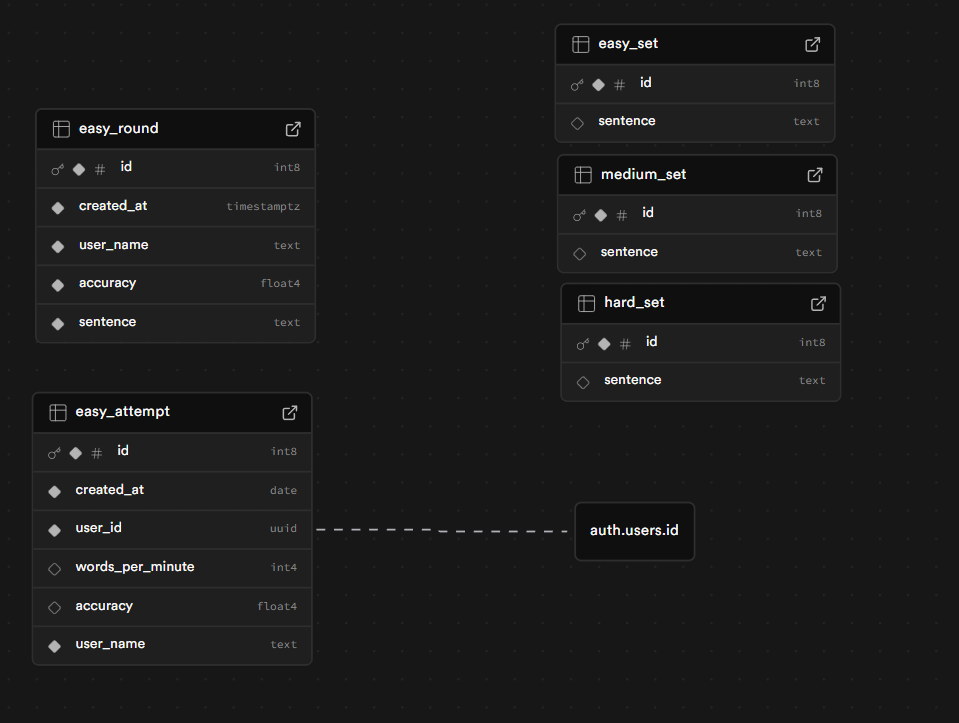

# ⌨️ TypingGame — Real-Time Typing Competition

> A real-time multiplayer typing competition platform built with Next.js.

🔗 **Live Demo:** [typing-game-two-sigma.vercel.app](https://typing-game-two-sigma.vercel.app/)

---
## Features

- 🎯 **Three difficulty modes** - Choose between Easy, Medium, and Hard
- 📅 **One attempt per difficulty per day** - Players can try each mode only once daily
- ⏱️ **20-second rounds** - Every round lasts exactly 20 seconds
- 📊 **End-of-game detailed stats** - See correct keystrokes, incorrect keystrokes, and overall accuracy
- 📋 **Live results table (Easy mode)** - Real-time updating table displaying `user_name`, accuracy, and sentence

---
## Tech Stack

| Layer     | Choice                  | Reason                                     |
| --------- | ----------------------- | ------------------------------------------ |
| Framework | Next.js 16 (App Router) | SSR, API routes, file-based routing        |
| Language  | TypeScript              | Type safety across the stack               |
| Realtime  | Supabase Realtime       | Fast to configure                          |
| Database  | Supabase                | Easy to use, good integration with next.js |
| Styling   | Tailwind CSS and shadcn | Utility classes, ready to use components   |
| Testing   | Playwright              | E2E                                        |

---
## Getting Started

### Prerequisites

- Node.js >= 20.9
- npm
### Installation
```bash
git clone https://github.com/piotrWaw1/typing-game.git
cd typing-game
npm install
```

### Environment Variables

Copy `.env` and fill in your values:

```bash
cp .env
```

```env
# .env
NEXT_PUBLIC_SUPABASE_URL=https://tpbwfjimtjqdiegteznz.supabase.co
NEXT_PUBLIC_SUPABASE_PUBLISHABLE_KEY=sb_publishable_kpLvIBBKdPRB2iGCX1PcIQ_u8cEKojE
```

### Run Locally

```bash
npm run dev
```

Open [http://localhost:3000](http://localhost:3000/).

---
## Running Tests

```bash
# E2E tests
npm run test:e2e
```

---

## Design Decisions

## Backend & Realtime

I chose **Supabase** because it provides a managed PostgreSQL database, authentication, Row Level Security (RLS), and realtime subscriptions in one solution.

This eliminated the need to build a separate backend server and allowed fast integration with **Next.js**. Realtime features enable live updates without polling, and RLS ensures secure, per-user data access directly at the database level.
## UI

I used **Tailwind CSS** with **shadcn/ui** to build the interface quickly and consistently.

Tailwind speeds up styling with utility classes, while shadcn provides accessible, customizable components.
## State Management

Lightweight client state is stored in URL search parameters. This keeps the implementation simple.
## Authentication & Security

Authentication is handled by Supabase. Users receive a token on login, and RLS policies verify database access automatically. This ensures secure data isolation without custom backend logic.
## Testing & Code Quality

I used **Playwright** for end-to-end testing and **Prettier** for consistent code formatting, improving reliability and maintainability.
## Scope Decision

Due to the 3-hour time constraint, I skipped matchmaking and instead implemented 3 game modes, each playable once per day.

This reduced backend complexity while maintaining fairness and competitiveness, allowing me to deliver a complete and stable product within the time limit.
## Database schema

---

## What I Would Add With More Time

- [ ] Historical stats & personal best tracking
- [ ] Room-based private lobbies
- [ ] Matchmaking system that assigns random players to a lobby.
- [ ] Animated progress bar for each player
- [ ] Mobile-responsive layout improvements
- [ ] CI/CD pipeline (GitHub Actions)
- [ ] Error monitoring (Sentry)
- [ ] More comprehensive test coverage

---
## AI Usage

- Boilerplate Next.js setup was scaffolded with `create-next-app -e with-supabase`
- Login and sign-up forms was generated form `create-next-app -e with-supabase`
- The `chellenge.tsx` was improve by AI
- UI component structure was hand-written; Tailwind class suggestions were assisted by Claude
- UI components in the `components/ui` folder are sourced from shadcn.
- Main page in `/` was improved by Claude.
- README formated by Claude.